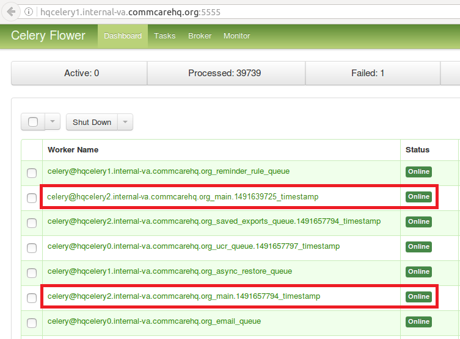
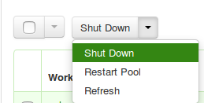
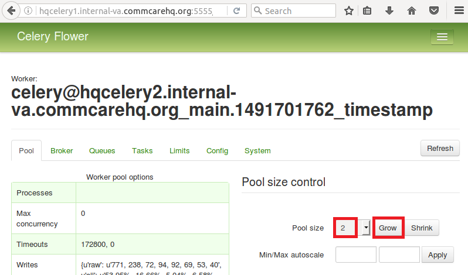

* TOC
{:toc}

# Common Celery Firefighting Scenarios

## Worker is down

### Symptoms

You check /serverup.txt?heartbeat (example: https://www.commcarehq.org/serverup.txt?heartbeat) and it shows the worker is down:
* celery@hqcelery2.internal-va.commcarehq.org_main.1491657794_timestamp worker is down
Using the environments and inventory files to find which machine hosts the worker, you log in and verify the worker is stopped:

```
dogeillionaire@hqcelery2:~$ sudo supervisorctl status
commcare-hq-production-celery_background_queue RUNNING    pid 10464, uptime 0:45:47
commcare-hq-production-celery_main STOPPED Apr 08 02:18 PM
commcare-hq-production-celery_saved_exports_queue RUNNING    pid 10463, uptime 0:45:47
commcare-hq-production-errand-boy RUNNING    pid 10465, uptime 0:45:47 
```

### Resolution
Start the worker:

```
dogeillionaire@hqcelery2:~$ sudo supervisorctl start commcare-hq-production-celery_main
commcare-hq-production-celery_main: started
```

Verify the worker is running:

```
dogeillionaire@hqcelery2:~$ sudo supervisorctl status
commcare-hq-production-celery_background_queue RUNNING    pid 10464, uptime 0:45:47
commcare-hq-production-celery_main RUNNING    pid 10462, uptime 0:01:22
commcare-hq-production-celery_saved_exports_queue RUNNING    pid 10463, uptime 0:45:47
commcare-hq-production-errand-boy RUNNING    pid 10465, uptime 0:45:47
```

## Worker won't start

### Symptoms

You check /serverup.txt?heartbeat (example: https://www.commcarehq.org/serverup.txt?heartbeat) and it shows the worker is down:
* celery@hqcelery2.internal-va.commcarehq.org_main.1491657794_timestamp worker is down
Using the environments and inventory files to find which machine hosts the worker, you log in and verify the worker has not been able to start:

```
dogeillionaire@hqcelery2:~$ sudo supervisorctl status
commcare-hq-production-celery_background_queue RUNNING    pid 10464, uptime 0:45:47
commcare-hq-production-celery_main FATAL
commcare-hq-production-celery_saved_exports_queue RUNNING    pid 10463, uptime 0:45:47
commcare-hq-production-errand-boy RUNNING    pid 10465, uptime 0:45:47
```

### Resolution

View the log file to see what the error is preventing the worker from starting and resolve that error. The log file name and location are given in the service template for supervisor.

`dogeillionaire@hqcelery2:/home/cchq/www/production/log$ cat celery_main.log | less`

 When viewing output with less, pressing shift+G takes you to the end of the file, just pressing G takes you to the beginning of the file, and page up / down scrolls pages.

The error might be an exception in python code raised when starting the worker up, in which case a code fix is needed. Sometimes the error might also be an out of memory issue. If it is an out of memory issue, you can check to see if the machine is still out of memory with htop. If the machine is still out of memory right now, you may need to look for an zombie celery processes from stale child worker processes that were not stopped at previous shutdown using `ps -ef | grep celery` and stop them with `kill` as the cchq user.

Once the error is fixed, follow the instructions under "Worker is down" to start the worker.

## Worker did not shut down properly

### Symptoms
You check /serverup.txt?heartbeat (example: https://www.commcarehq.org/serverup.txt?heartbeat) and it shows the worker is running when it shouldn't be:
* celery@hqcelery2.internal-va.commcarehq.org_main.1491639725_timestamp celery worker is running when we expect it to be stopped

### Resolution

To kill the workers that didn't shut down properly, you can use the `commcare-cloud <env> fab kill_stale_celery_workers`. This will automatically figure out which ones to kill. If that still doesn't work, follow the steps below.

Using the environments and inventory files to find which machine hosts flower, use your browser to hit port 5555 on that machine (example: http://hqcelery1.internal-va.commcarehq.org:5555/) to view flower.

On the dashboard you should see two of the same workers listed as being online, but with different timestamps in their name:



Check the box next to the worker you saw in the serverup notice (which should also be the one with the older, or smaller, timestamp), and shut it down by selecting Shut Down from the dropdown at the top of the page:




## Worker is deadlocked

### Symptoms

The worker is running (so there is no down notice), but it won't accept new tasks.
If the main worker is deadlocked, people may be reporting that they can't do exports or imports of data.
When you view the current active tasks for the worker with the show_celery_tasks management command, it either shows no tasks or tasks that are hours old.

### Resolution

Restart the worker:

```
dogeillionaire@hqcelery2:~$ sudo supervisorctl restart commcare-hq-production-celery_main
commcare-hq-production-celery_main: stopped
commcare-hq-production-celery_main: started
```

Verify the worker is running:

```
dogeillionaire@hqcelery2:~$ sudo supervisorctl status
commcare-hq-production-celery_background_queue RUNNING    pid 10464, uptime 0:45:47
commcare-hq-production-celery_main RUNNING    pid 10462, uptime 0:01:22
commcare-hq-production-celery_saved_exports_queue RUNNING    pid 10463, uptime 0:45:47
commcare-hq-production-errand-boy RUNNING    pid 10465, uptime 0:45:47
```

## The queue the worker is consuming from has a large backlog of tasks

### Symptoms

The datadog monitor for queued tasks has given an alert for the queue that the worker consumes from.

If the main queue has a large backlog of tasks, people may be reporting that they can't do exports or imports of data.

When you view the current active tasks for the worker with the show_celery_tasks management command, it shows tasks that are relatively fresh, so you don't believe the worker is deadlocked.

### Resolution

For the most part, we just have to wait until the tasks are processed. If it's impacting something like exports/imports, It's worth trying to estimate how long it will take and put up a banner mentioning exports/imports are down at the moment and to not keep retrying them as it will just exacerbate the issue.

If this happens often for the same queue, then it means a longer-term solution is needed, such as increasing the concurrency on the worker, reducing the time it takes for the tasks to be completed, or moving the tasks to a different queue (or to a new queue and worker). However, there are a couple short-term things we may be able to do to help reduce the time we need to wait before it's back to normal:

1. If you log into the machine where the worker is hosted and there is a good amount of free memory (at least 2GB or so), you can temporarily increase the concurrency on the worker.  To do this:

    a. Using the environments and inventory files to find which machine hosts flower, use your browser to hit port 5555 on that machine (example: http://hqcelery1.internal-va.commcarehq.org:5555/) to view flower.

    b. From the dashboard, click the name of the worker which consumes from the queue that is backed up.

    c. Under "Pool size control", increase the number of child processes that worker has by selecting a number of processes to increase by in the dropdown and click the "Grow" button. For example, if the current concurrency is 4 and you select 2 in the dropdown and click "Grow", the new max concurrency will be 6.



Be careful with this - if you increase by too much you may start to see tasks failing with out of memory (SIGSEGV) errors. Rule of thumb is to only increase by 2 processes per 1 GB of memory you can use up, and always try to leave at least 1 GB of memory free on the machine at all times. So if there's 2 GB of memory free, only increase by 2, and if there's 3 GB of memory free, only increase by 4. If you start having out of memory issues after you do this, you'll need to either shrink the pool or restart the worker.

This rule of thumb also does not apply to the workers that use gevent pooling - we can be a little more liberal about increasing the concurrency on those, keeping in mind that whatever you increase it to, that many threads may be running at a time.

Also note this only temporary; once the worker is restarted on next deploy or manually, it will go back to its old concurrency setting.

2. If there are a lot of tasks clogging up the queue that are not worth processing anymore (for example, exports that people had initiated long ago that they are no longer waiting for), you can revoke those tasks. To do this, do the following:
    a. Log into any machine on the cluster (it doesn't have to be where the worker is hosted), and prep the environment as you would for entering a django shell or running any management command:

```
dogeillionaire@hqcelery0:~$ sudo -u cchq bash
cchq@hqcelery0:~$ cd /home/cchq/www/production/current
cchq@hqcelery0:/home/cchq/www/production/current$ source python_env/bin/activate
(python_env) cchq@hqcelery0:/home/cchq/www/production/current$
```

    b. Invoke the revoke_celery_tasks management command, passing the fully qualified task names to revoke as args:

```
(python_env) cchq@hqcelery0:/home/cchq/www/production/current$ python manage.py revoke_celery_tasks corehq.apps.export.tasks.populate_export_download_task
2017-04-09 12:34:19.525830 Revoked 161a7623a3f444e7b361da4b4fa6fc42 corehq.apps.export.tasks.populate_export_download_task
2017-04-09 12:34:26.803201 Revoked a855bac716ca4850899866cc97076c3d corehq.apps.export.tasks.populate_export_download_task
```

This command will just keep running, revoking all existing and new tasks that it finds that match the given task name(s). This command is only able to revoke tasks received by the worker from rabbitmq. The worker does not see all the tasks in the queue all at once since the tasks are prefetched by the worker from rabbitmq a little at a time, so to revoke them all you just have to keep it running. When you no longer need it, just stop it with Ctrl+C.

# Common RabbitMQ Firefighting Scenarios

## RabbitMQ is down

### Symptoms

There are 500 emails saying Connection Refused to a service running on port 5672

You see errors mentioning a celery worker cannot connect to amqp broker in the celery logs

### Resolution

See Restarting Services on this [page](firefighting/index.md).

## Disk filling up

### Symptoms

Disk usage warning

### Resolution

1. Use 'ncdu' on the machine to detemine if it's RabbitMQ that's using up the disk
2. Check the RabbitMQ dashboard to determine which queue is causing the issue
   a. https://app.datadoghq.com/screen/integration/237/rabbitmq---overview
3. Ensure that the celery workers are running and consuming the queue
4. Use rabbitmqctl to purge the queue. *Only do this if the tasks can be re-queued e.g. pillow_retry_queue*

`rabbitmqctl purge_queue -p commcarehq [queue name]`

# Useful Celery Commands

## Show celery tasks

Unfortunately, flower often times will show stale data. To view the most current information on active, reserved, or scheduled tasks for a worker, use this command.

`python manage.py show_celery_tasks <worker name> <task state>`

This command prints the celery tasks in the given state on the given worker. For example, to show all active tasks being processed by the main worker:

`python manage.py show_celery_tasks celery@hqcelery2.internal-va.commcarehq.org_main.1491701762_timestamp active`

To view a list of worker names, use the show_celery_workers command.

## Show celery workers

To get a quick list of workers that are currently running, use this command:

`python manage.py show_celery_workers`

## Shut down a celery worker

To initiate a warm shutdown for a worker, you can either use flower as described in the "Worker did not shut down properly" section above, or you can use this command:

`python manage.py shutdown_celery_worker_by_hostname <worker name>`

The <worker name> parameter will be one of the values you get from running `python manage.py show_celery_workers`.

## Revoke celery tasks

To revoke specific tasks, issue this command, passing the fully-qualified python task names as args:

`python manage.py revoke_celery_tasks <task name 1> <task name 2> ...`

This command revokes all active, reserved, and scheduled tasks (from all workers that are online) matching any of the given fully-qualified task names. It's best to leave this command running for a bit in order to get them all, as it will keep polling for tasks to revoke, and there are likely to be tasks in the message queue which haven't been received by the worker yet. This command can be useful, for example, if there is a huge backlog of export tasks that are stale and are just causing the queue to be backed up.  For example, to revoke all export tasks, keep this running for a bit (every time a task is revoked it will be printed to the console):

`python manage.py revoke_celery_tasks corehq.apps.export.tasks.populate_export_download_task`

You can pass more than one task to this command, and you can stop it any time with Ctrl+C.

## Purge queue

NOTE: This should almost never be necessary in production and can be more useful during local development. In production it's better to target specific tasks to revoke using the revoke_celery_tasks command described above.  In case you do need to do this in production, It's best to stop the worker that's consuming from that queue first:

`sudo supervisorctl stop <...>`

and then restart it after purging:

`sudo supervisorctl start <...>`

To purge all messages in a rabbitmq message queue:

`python manage.py celery amqp queue.purge <queue name>`

# Useful RabbitMQ Commands

We use rabbitmqctl to inspect RabbitMQ. All rabbitmqctl commands must be run as the root user on the machine hosting RabbitMQ.

Locally you can use sudo to run these commands, but in a production environment you'll need to switch to the root user first.

The <vhost name> parameter is commcarehq in our production environments. Locally you might have this set to /, but you can check it with the list virtual hosts command.

## List Virtual Hosts

`rabbitmqctl list_vhosts`

## List number of messages in each queue

This command lists the number of messages in each queue (i.e., the number of tasks in each celery queue) that are either ready to be delivered to a consumer or have been delivered but have not been acknowledged yet.

`rabbitmqctl list_queues -p <vhost name> name messages`
