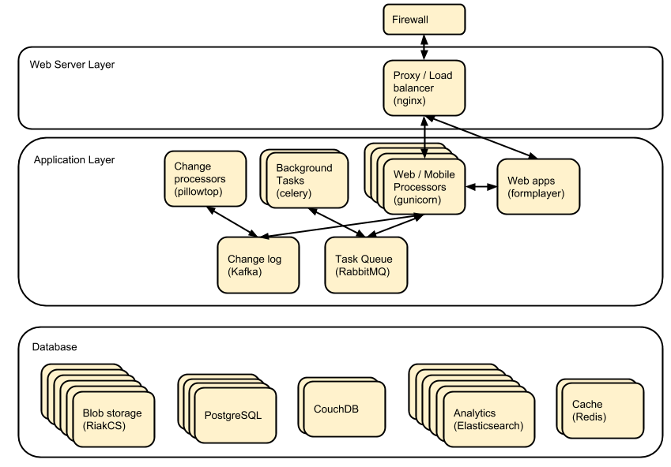

This page summarizes how to do various things related to HQ.

#### Notes
{:.no_toc}

All Datadog links will be specific and private to Dimagi employees.
If datadog releases a feature to share dashboard configurations, we will happily share configurations in this repository.

For a more user-friendly guide check out [Cory's brown bag on the topic](http://prezi.com/wedwm-dgqto7/firefighting-hq/).

## Contents
{:.no_toc}

* TOC
{:toc}

# HQ Architecture and Machines



# High-level System Monitoring and Alerts

[HQ Vitals](https://app.datadoghq.com/dashboard/g9s-pw6-tpg/hq-vitals?to_ts=1549314000000&is_auto=false&from_ts=1549227600000&live=true&tile_size=m&page=0) - Various graphs on datadog

[Datadog Alerts](https://app.datadoghq.com/monitors/manage?q=status%3A(alert%20OR%20warn%20OR%20"no%20data")) - these are also often reported on #hq-ops or #hq-ops-priority on slack

https://www.commcarehq.org/hq/admin/system/ - catchall system info, contains deploy history, pillowtop info, and a bunch of other stuff

https://www.commcarehq.org/hq/admin/system/check_services - plaintext URL that checks the status of a bunch of support services

# In case of a reboot

## After reboot, whether or not it was deliberate

In case a machine has automatically rebooted or you needed to reboot a machine,
you will need to run the after-reboot protocol directly afterwards.
You can specify a single server by IP address, a single server by its name in inventory.ini.
You will have to confirm to run, and then provide the vault password for your environment.

```bash
$ cchq <env> after-reboot [all|<group>|<server>]
Do you want to apply without running the check first? [y/N]y
```

You don't always control the reboot process (sometimes our provider will expectedly or unexpectedly reboot a VM), but if you do, here's the process end to end:

```bash
# Before shutting down VMs
$ cchq <env> fab supervisorctl:'stop all'
$ cchq <env> ansible-playbook stop_servers.yml

# After restarting VMs
$ cchq <env> after-reboot all
$ cchq <env> fab manage:check_services  # ping various auxiliary services to make sure they're up
  # if any services aren't running, you may have to manually start them:
$ # cchq <env> run-module all service 'name=<service> state=started'
$ cchq <env> fab restart_services  # start app processes
```

# In case of network outage

If there has been a network outage in a cluster (e.g. firewall reboot), the following things should be checked to verify they are working:

## Check services

```bash
$ ./manage.py check_services
# or go to
https://[commcarehq.environment.path]/hq/admin/system/check_services
```

## Check that change feeds are still processing

You can use this graph on [datadog](https://app.datadoghq.com/dashboard/ewu-jyr-udt/change-feeds?to_ts=1549314000000&is_auto=false&live=true&from_ts=1549227600000&tile_size=m&page=0&fullscreen_widget=185100827)

# Service Information

Restarting services: `cchq <env> service <service_name> restart`

Stopping services: `cchq <env> service <service_name> stop`

Service logs: `cchq <env> service <service_name> logs`

## Datadog Dashboards

[postgres/pgbouncer](https://app.datadoghq.com/dash/263336/postgres---overview)

[redis](https://app.datadoghq.com/dash/290868/redis-timeboard)

[rabbitmq](https://app.datadoghq.com/screen/487480/rabbitmq---overview)

[pillow](https://app.datadoghq.com/dash/256236/change-feeds-pillows)

[celery/celerybeat](https://app.datadoghq.com/dash/141098/celery-overview)

[elasticsearch](https://app.datadoghq.com/screen/127236/es-overview)

[kafka](https://app.datadoghq.com/screen/516865/kafka---overview-cloned)

[Blob DB Dashboard](https://app.datadoghq.com/dashboard/753-35q-fwt/blob-db-dashboard)

[couch](https://app.datadoghq.com/screen/177642/couchdb-dashboard)

# Switching to Maintenance Page

To switch to the Maintenance page, if you stop all web workers then the proxy will revert to "CommCareHQ is currently undergoing maintenance...".

```bash
$ cchq <env> fab webworkers supervisorctl:"stop all"
```

To stop all supervisor processes use:

```bash
$ cchq <env> fab supervisorctl:"stop all"
```

# Couch 2.0

## Couch node is down

If a couch node is down, it could mean that it is either very slow at responding to requests or it has stopped running.

Monitors are setup to ping the proxy instead of couch instance directly, so the error will appear as instance:http://<proxy ip>/_node/couchdb_<couch node ip>/

1. log into couch node ip
2. service couchdb2 status
3. If it's not running start it and begin looking through log files (on the proxy, couch's files, maybe kernel or syslog files as well) to see if you can determine the cause of downtime
4. If it is running it could just be very slow at responding.
    a. Use fauxton to see if any tasks are running that could cause couch to become unresponsive (like large indexing tasks)
    b. It could also have ballooned (ICDS) which is out of our control
5. If it's unresponsive and it's out of our control to fix it at the time, go to the proxy machine and comment out the fault node from the nginx config. This will stop sending requests to that server, but it will continue to replicate. When the slowness is over you can uncomment this line and begin proxying reads to it again

## Compacting a shard

If a couch node is coming close to running out of space, it may not have enough space to compact the full db. You can start a compaction of one shard of a database using the following:

`curl "<couch ip>:15986/shards%2F<shard range i.e. 20000000-3fffffff>%2F<database>.<The timestamp on the files of the database>/_compact" -X POST -H "Content-Type: application/json" --user <couch user name>`

It's important to use port 15986. This is the couch node endpoint instead of the cluster. The only way to find the timstamp is to go into /opt/data/couchdb2/shards and look for the filename of the database you want to compact

If it's a global database (like _global_changes), then you may need to compact the entire database at once

`curl "<couch ip>:15984/_global_changes/_compact" -X POST -H "Content-Type: application/json" --user <couch user name>`

# Nginx

Occasionally a staging deploy fails because during a previous deploy, there was an issue uncommenting and re-commenting some lines in the nginx conf.

When this happens, deploy will fail saying

nginx: configuration file /etc/nginx/nginx.conf test failed
To fix, log into the proxy and su as root. Open the config and you'll see something like this

```
/etc/nginx/sites-enabled/staging_commcare
#
# Ansible managed, do not edit directly
#

upstream staging_commcare {
  zone staging_commcare 64k;

    least_conn;

#server hqdjango0-staging.internal-va.commcarehq.org:9010;
#server hqdjango1-staging.internal-va.commcarehq.org:9010;
}
```

Ignore the top warning. Uncomment out the servers. Retsart nginx. Run restart_services.

# NFS & File serving / downloads

For downloading files we let nginx serve the file instead of Django. To do this Django saves the data to a shared NFS drive which is accessible to the proxy server and then returns a response using the XSendfile/X-Accel-Redirect header which tells nginx to look for the file and serve it to the client directly.

The NFS drive is hosted by the DB machine e.g. hqdb0 and is located at /opt/shared_data (see ansible config for exact name). On all the client machines it is located at /mnt/shared_data (again see ansible config for exact name),

## Troubleshooting
### Reconnecting the NFS client

It is possible that the mounted NFS folder on the client machines becomes disconnected from the host in which case you'll see errors like "Webpage not available"

To verify that this is the issue log into the proxy machine and check if there are any files in the shared data directories. If there are folders but no files then that is a good indication that the NFS connections has been lost. To re-establish the connection you should unmount and re-mount the drive:

```bash
$ su
$ umount -l /mnt/shared_data
$ mount /mnt/shared_data
# verify that it is mounted and that there are files in the subfolders
```

### Forcing re-connection of an NFS client in a webworker

It may happen, specially if the client crashes or has kernel oops, that a connection gets in a state where it cannot be broken nor re-established.  This is how we force re-connection in a webworker.
1. Verify NFS is actually stuck
    a. “df” doesn’t work, it hangs. Same goes for lsof.
    b. “umount” results in umount.nfs: /mnt/shared_icds: device is busy
2. top all gunicorns and supervisor
    a. `sudo supervirsorctl stop all`
    b. jVerify “stuck” processes keep running: $ ps aux|grep gunicorn
    c. $ sudo service supervisord stop
    d. Verify “stuck” processes are gone: $ ps aux|grep gunicorn
3. Force umount 
    a. $ sudo umount -f /mnt/shared_icds
4. Re-mount
    a. $ sudo mount /mnt/shared_icds
    b. Verify NFS mount works: $ df
5. Start supervisor and gunicorns
    a. $ sudo service supervisord start
    b. $ sudo supervisorctl start all

If none of the above works check that nfsd is running on the shared_dir_host.

```bash
$ ps aux | grep nfsd
$ service nfs-kernel-server status
```

# Pgbouncer

We use pgbouncer as a connection pooler for PostgreSQL.

It is configured to use the "transaction"  pool mode which means that each server connection is assigned to client only during a transaction. When PgBouncer notices that transaction is over, the server will be put back into pool. This does have some limitations in terms of what the client can do in the connection e.g. no prepared statements. The full list of supported / unsupported operations is found on the pgboucer wiki.

## Get a pgbouncer shell

`$ psql -U {commcarehq-user} -p 6432 pgbouncer`

## Check connection status

```
pgbouncer=# show pools;
  database  |      user      | cl_active | cl_waiting | sv_active | sv_idle | sv_used | sv_tested | sv_login | maxwait
------------+----------------+-----------+------------+-----------+---------+---------+-----------+----------+---------
 commcarehq | ************** |        29 |          0 |        29 |      10 |       8 |         0 |        0 |       0
 pgbouncer  | pgbouncer      |         1 |          0 |         0 |       0 |       0 |         0 |        0 |       0

pgbouncer=# show clients;
 type |      user      |  database  | state  |      addr      | port  |  local_addr   | local_port |    connect_time     |    request_time     |    ptr    |   link
------+----------------+------------+--------+----------------+-------+---------------+------------+---------------------+---------------------+-----------+-----------
 C    | ************** | commcarehq | active | 10.209.128.58  | 39741 | 10.176.193.42 |       6432 | 2015-05-21 12:48:57 | 2015-05-21 13:44:07 | 0x1a59cd0 | 0x1a556c0
 C    | ************** | commcarehq | active | 10.209.128.58  | 40606 | 10.176.193.42 |       6432 | 2015-05-21 13:04:34 | 2015-05-21 13:04:34 | 0x1a668d0 | 0x1a6f590
 C    | ************** | commcarehq | active | 10.177.130.82  | 45471 | 10.176.193.42 |       6432 | 2015-05-21 13:17:04 | 2015-05-21 13:44:21 | 0x1a32038 | 0x1a8b060
 C    | ************** | commcarehq | active | 10.177.130.82  | 45614 | 10.176.193.42 |       6432 | 2015-05-21 13:17:23 | 2015-05-21 13:17:23 | 0x1a645a8 | 0x1a567a0
 C    | ************** | commcarehq | active | 10.177.130.82  | 45680 | 10.176.193.42 |       6432 | 2015-05-21 13:17:31 | 2015-05-21 13:44:21 | 0x1a6a110 | 0x1a8a250
```

The columns in the "show pools" output have the following meanings:

cl_active: Connections from clients which are associated with a PostgreSQL connection
cl_waiting: Connections from clients that are waiting for a PostgreSQL connection to service them
sv_active: Connections to PostgreSQL that are in use by a client connection
sv_idle: Connections to PostgreSQL that are idle, ready to service a new client connection
sv_used: PostgreSQL connections recently released from a client session. These will end up in sv_idle if they need to once pgbouncer has run a check query against them to ensure they are in a good state.
max_wait: The length of time the oldest waiting client has been waiting for a connection

If you want to monitor the connections over a short period of time you can run this command (while logged in as the cchq user): `watch -n 2 pgb_top`
You can also access the pgbouncer console easily with this command (while logged in as the cchq user): `pgb`

# Postgres Troubleshooting

## Common restart problems
If you see something like the following line in the logs:

could not open file ""/etc/ssl/certs/ssl-cert-snakeoil.pem"": Permission denied
You can run the following commands to fix it

```
cd /opt/data/postgresql/9.4/main/
chown postgres:postgres server.crt
chown postgres:postgres server.key
```

More information on this error is available [here](https://wiki.postgresql.org/wiki/May_2015_Fsync_Permissions_Bug).

## Dealing with too many open connections

Sometimes Postgres gets into a state where it has too many open connections. In this state HQ gets very slow and you will see many 500 errors of the form: "OperationalError : FATAL:  remaining connection slots are reserved for non-replication superuser connections"

In this case you can check what machines are hogging connections by logging into postgres and using the following steps:

### Get a postgres shell
```
$ su
$ sudo -u postgres psql commcarehq
```

# Check open connections
select client_addr, datname as database, count(\*) as total, sum(case when query = '<IDLE>' then 1 else 0 end) as idle from pg_stat_activity group by client_addr, datname;
This will print something like the following:

```
  client_addr   | database   | total | idle
----------------+------------+-------+------
                | commcarehq |    4 |   2
 10.209.128.58  | commcarehq |    9 |   5
 10.177.130.82  | commcarehq |    7 |   7
 10.208.22.37   | commcarehq |    6 |   5
 10.223.145.60  | commcarehq |    1 |   0
 10.208.148.179 | commcarehq |    3 |   3
 10.176.132.63  | commcarehq |   24 |   23
 10.210.67.214  | commcarehq |    3 |   2
```

When using pgbouncer the following command can be used to list clients:

```
$ psql -h localhost -p 6432 -U $USERNAME pgbouncer -c "show clients" | cut -d'|' -f 5 | tail -n +4 | sort | uniq -c
    10  10.104.103.101
     5  10.104.103.102
     2  10.104.103.104
```

### See Running Queries
To see a list of queries (ordered by the long running ones first) you can do something like the following. This can also be exported to csv for further analysis.

`SELECT pid, datname, query_start, now() - query_start as duration, state, query as current_or_last_query FROM pg_stat_activity WHERE state = 'active' OR query_start > now() - interval '1 min' ORDER BY state, query_start;`

 This can also be exported to csv for further analysis.

`Copy (SELECT state, query_start, client_addr, query FROM pg_stat_activity ORDER BY query_start) TO '/tmp/pg_queries.csv' WITH CSV;`

### Find queries that are consuming IO

Use `iotop` to see what processes are dominating the IO and get their process IDs.

### Filter the list of running queries by process ID:

`SELECT pid, query_start, now() - query_start as duration, client_addr, query FROM pg_stat_activity WHERE procpid = {pid} ORDER BY query_start;`

### Kill connections
*DO NOT EVER `kill -9` any PostgreSQL processes. It can bring the DB process down.*

This shouldn't be necessary now that we've switched to using pgbouncer (but it still is currently!).

After checking open connections you can kill connections by IP address or status. The following command will kill all open IDLE connections from localhost (where pgbouncer connections route from) and is a good way to reduce the load:

#### Kill all idle connections
`SELECT pg_terminate_backend(procpid) FROM pg_stat_activity WHERE client_addr = '127.0.0.1' AND query = '<IDLE>';`

#### Kill a single query
`SELECT pg_terminate_backend({procpid})`

## Postgres Hot Standby

In situations where the disk becomes corrupt or unusable, you can switch HQ to utilize a hotstandby. 

### Standby Description
The postgres standby is a hot standby (hot standby means that it can accept reads but not writes) of our production database. The standby keeps up with the production database through log shipping. As write ahead logs (WALs) are completed in the main database, they are sent to a directory on the standby machine (currently /opt/data/postgresql/wal_archive) where their operations are replicated into the standby database.

### Creating the standby with ansible
Assumes that the deploy_db.yml playbook has already been applied to the standby node.

`$ commcare-cloud <env> ansible-playbook setup_pg_standby.yml -e standby=[standby node]`

### Failover to standby with ansible

`$ commcare-cloud <env> ansible-playbook promote_pg_standby.yml -e standby=[standby node]`

### Replication Delay
https://www.enterprisedb.com/blog/monitoring-approach-streaming-replication-hot-standby-postgresql-93

* Check logs for anything suspicious
* Checking replication delay
  * [Use datadog](https://app.datadoghq.com/dash/263336/postgres---overview?live=true&page=0&is_auto=false&from_ts=1511770050831&to_ts=1511773650831&tile_size=m&tpl_var_env=*&fullscreen=253462140&tpl_var_host=*)
  * Run queries on nodes:

```sql
--- on master
select
  slot_name,
  client_addr,
  state,
  pg_size_pretty(pg_xlog_location_diff(pg_current_xlog_location(), sent_location)) sending_lag,
  pg_size_pretty(pg_xlog_location_diff(sent_location, flush_location)) receiving_lag,
  pg_size_pretty(pg_xlog_location_diff(flush_location, replay_location)) replaying_lag,
  pg_size_pretty(pg_xlog_location_diff(pg_current_xlog_location(), replay_location)) total_lag
from pg_replication_slots s
left join pg_stat_replication r on s.active_pid = r.pid
where s.restart_lsn is not null;

-- On standby

SELECT now() - pg_last_xact_replay_timestamp() AS replication_delay;
```

In some cases it may be necessary to restart the standby node.

## PgBackrest (deprecated)
At the time of writing we only use pgbackrest as a backup method on softlayer db0. If we start running out of disk space on either machine, old backups might need to be expired and the backup retention settings in /etc/pgbackrest.conf might need to be updated.

The [pgbackrest user guide is here](http://www.pgbackrest.org/user-guide.html), but below is some useful info.

### Viewing Current Backups
To see the backups that are currently stored, run this command as postgres user: `pgbackrest info`

The "repository backup size" tells you how much actual disk space the given backup is taking up on the machine, after compression.

### Manually Expiring Backups

Backups get expired automatically according to the retention settings in /etc/pgbackrest.conf. If you need to manually expire backups, you'll need to use the `expire` command. It doesn't seem like you can expire specific backups, all you can do is expire either the oldest "full" backup(s) or the oldest "differential" backups(s). Expiring a "full" backup also expires all "differential" backups it's associated with.

For example, if /etc/pgbackrest.conf is retaining 4 full backups, to expire the oldest full backup you'll need to run the `expire` command manually to give a different value for the retention-full setting:

```
# run as postgres user; this assumes the stanza's name in /etc/pgbackrest.conf is 'backup' for the backups you want to expire
pgbackrest --stanza=backup --log-level-console=info --retention-full=3 expire
```

You can use a similar command to expire old differential backups by overriding the retention-diff setting which also resides in /etc/pgbackrest.conf:

```
# run as postgres user; this assumes the stanza's name in /etc/pgbackrest.conf is 'backup' for the backups you want to expire
pgbackrest --stanza=backup --log-level-console=info --retention-diff=2 expire
```

If the machine can't support the current retention settings, then either more storage should be added or the retention settings should be changed in /etc/pgbackrest.conf.

## PostgreSQL disk usage
Use the following query to find disc usage by table where child tables are added to the usage of the parent.

### Check disk usage by parent table
```
SELECT
    CASE WHEN HC.inhrelid IS NOT NULL THEN CP.relname
        ELSE C.relname END as main_table,
    sum(pg_total_relation_size(C.oid)) AS "total_size"
FROM pg_class C
LEFT JOIN pg_namespace N ON (N.oid = C.relnamespace)
LEFT JOIN pg_inherits HC ON (HC.inhrelid = C.oid)
LEFT JOIN pg_class CP ON (HC.inhparent = CP.oid)
WHERE nspname NOT IN ('pg_catalog', 'information_schema')
    AND C.relkind <> 'i' AND C.relkind <> 'S' AND C.relkind <> 'v'
    AND nspname !~ '^pg_toast'
GROUP BY main_table
ORDER BY total_size DESC
LIMIT 20;
```

# Celery

Check out this [child page](firefighting/celery.md)

## Monitoring
Sometimes it's helpful to check "Flower", a UI for celery monitoring http://hqcelery1.internal-va.commcarehq.org:5555/ (you have to be VPN'd in).

You can also check the current celery queue backlogs on datadog.  Any spikes indicate a backup, which may result in things like delays in sending scheduled reports or exports.  If there's a problem, there should also be an alert here and on #hq-ops on Slack.

Also, see the bottom of this page for some useful firefighting commands.

## Celery consuming all the disk space
On occasion, the celery_taskmeta table grows out of control and takes up all the disk space on the database machine very quickly. Often one our disk space monitors will trip when this happens. To diagnose and ensure that the it is indeed the celery_taskmeta table that has grown too large, you can run the above Postgres command to check disk usage by table.

To fix the issue, you can then run these commands in a psql shell after stopping the Celery workers:

```
# Ensure Celery workers have been stopped
truncate celery_taskmeta;
vacuum full celery_taskmeta;
# Start Celery workers again
```

# Elasticsearch

## Check Cluster Health
It's possible to just ping (a) server(s):


```
$ curl -XGET 'http://es[0-3].internal-icds.commcarehq.org:9200/'
{
  "status" : 200,
  "name" : "es0",
  "cluster_name" : "prodhqes-1.x",
  "version" : {
    "number" : "1.7.3",
    "build_hash" : "05d4530971ef0ea46d0f4fa6ee64dbc8df659682",
    "build_timestamp" : "2015-10-15T09:14:17Z",
    "build_snapshot" : false,
    "lucene_version" : "4.10.4"
  },
  "tagline" : "You Know, for Search"
}
```

Or check for health:

```
$ curl -XGET 'http://es0.internal-icds.commcarehq.org:9200/_cluster/health?pretty=true'
{
  "cluster_name" : "prodhqes-1.x",
  "status" : "green",
  "timed_out" : false,
  "number_of_nodes" : 4,
  "number_of_data_nodes" : 4,
  "active_primary_shards" : 515,
  "active_shards" : 515,
  "relocating_shards" : 0,
  "initializing_shards" : 0,
  "unassigned_shards" : 0,
  "delayed_unassigned_shards" : 0,
  "number_of_pending_tasks" : 0,
  "number_of_in_flight_fetch" : 0
}
```

## Low disk space free
"[INFO ][cluster.routing.allocation.decider] [hqes0] low disk watermark [85%] exceeded on ... replicas will not be assigned to this node"

is in the logs, then ES is running out of disk space.  If there are old, unused indices, you can delete them to free up disk space.

```
$ ./manage.py prune_elastic_indices --delete
Here are the indices that will be deleted:
hqapps_2016-07-08_1445
hqusers_2016-02-16_1402
report_xforms_20160707_2322
xforms_2016-06-09
```

Hopefully there are stale indices to delete, otherwise you'll need to investigate other options, like increasing disk size or adding a node to the cluster.  Be sure to check the disk usage after the deletions have completed.

## Request timeouts
"ESError: ConnectionTimeout caused by - ReadTimeoutError(HTTPConnectionPool(host='hqes0.internal-va.commcarehq.org', port=9200): Read timed out. (read timeout=10))"

This could be caused by a number of things but a good process to follow is to check the [ES dashboard on Datadog](https://app.datadoghq.com/screen/127236/es-overview) and the slow logs on the ES machines:

```
# folder + filename may not be exact
$ tail -f /opt/data/elasticsearch-1.7.1/logs/prodhqes-1.x_index_search_slowlog.log
```

## Unassigned shards
Currently on ICDS (maybe on prod/india) shard allocation is disabled. If there are unassigned shards you should run:

```
curl -XPUT '<es url/ip>:9200/_cluster/settings' -d '{ "transient":
  { "cluster.routing.allocation.enable" : "all"
  }
}'
# wait for shards to be allocated
./scripts/elasticsearch-administer.py <es url> shard_status # all shards should say STARTED
curl -XPUT '<es url/ip>:9200/_cluster/settings' -d '{ "transient":
  { "cluster.routing.allocation.enable" : "none"
  }
}'
./manage.py ptop_reindexer_v2 <index that had the unassigned shards> # run this in a tmux/screen session as it will likely take a while
./scripts/elasticsearch-administer.py <es url> shard_status # the shards for indexes that had unassigned shards should have around the same number of docs
```

Make sure to run the management command in the most recent release directory (may not be current if this failed before the entire deploy went through)

# Redis
[Understanding the Top 5 Redis Performance Metrics](https://www.datadoghq.com/pdf/Understanding-the-Top-5-Redis-Performance-Metrics.pdf)

## Selectively flushing keys
Sometimes in order for a fix to propagate you'll need to flush the cache for certain keys. You can use this script to selectively flush keys by globbing.

```
redis-cli
127.0.0.1:6379> EVAL "local keys = redis.call('keys', ARGV[1]) \n for i=1,#keys,5000 do \n redis.call('del', unpack(keys, i, math.min(i+4999, #keys))) \n end \n return keys" 0 unique-cache-key*
```

A lot of times Redis will prefix the cache key with something like `:1:` so you'll often need to do \*unique-cache-key\*

## Disk full / filling rapidly
We have seen a situation where the redis disk fills up with files of the pattern /opt/data/redis/temp-rewriteaof-\*.aof. This happens when redis maxmemory is configured to be too high a proportion of the total memory (although the connection is unclear to the author, Danny). This blog http://oldblog.antirez.com/post/redis-persistence-demystified.html/ explains AOF rewrite files. The solution is to (1) lower maxmemory and (2) delete the temp files.

```
root@redis0:/opt/data/redis# cd /opt/data/redis/
root@redis0:/opt/data/redis# redis-cli
127.0.0.1:6379> CONFIG SET maxmemory 4gb
OK
(1.06s)
root@redis0:/opt/data/redis# rm temp-rewriteaof-\*.aof
```

# Riak CS

## Pinging a Riak Machine

A simple way to check if riak is working is to use the `check_services` management command.  If that's showing it as down, make sure the services are running on all machines.  Riak usually runs on port 8080.  You should be able to curl any riak machine like so and see that you get a response from the Riak CS server.

```
$ curl -I hqriak0.internal-va.commcarehq.org:8080
HTTP/1.1 405 Method Not Allowed
Server: Riak CS
Date: Mon, 21 Nov 2016 23:24:00 GMT
Content-Type: application/xml
Content-Length: 216
Allow: GET
```

Another thing you can do to get a visual on riak is log on to a riak machine, `su` to root, and run `riak-admin cluster status`

```
root@staging-hqdjango2:/home/cchq/www/staging/current# riak-admin cluster status
---- Cluster Status ----
Ring ready: true

+----------------------------------------------------------------------+------+-------+-----+-------+
|                                 node                                 |status| avail |ring |pending|
+----------------------------------------------------------------------+------+-------+-----+-------+
| (C) riak-hqdjango2-staging@hqdjango2-staging.internal.commcarehq.org |valid |  up   | 25.0|  --   |
|     riak-hqdjango3-staging@hqdjango3-staging.internal.commcarehq.org |valid |  up   | 25.0|  --   |
|     riak-hqdjango4-staging@hqdjango4-staging.internal.commcarehq.org |valid |  up   | 25.0|  --   |
|     riak-hqdjango5-staging@hqdjango5-staging.internal.commcarehq.org |valid |  up   | 25.0|  --   |
+----------------------------------------------------------------------+------+-------+-----+-------+

Key: (C) = Claimant; availability marked with '!' is unexpected
```

## Riak is Out of Memory

The most common problem we have had with Riak and Riak CS is running [out of memory](https://docs.basho.com/riak/kv/2.1.4/using/repair-recovery/failure-recovery/#out-of-memory). Most of the time this is non-actionable; nodes will crash and automatically restart and operation usually returns to normal without intervention. If a node is consistently running out of memory then it is likely necessary to either allocate more memory (usually done by creating a new node with more memory) or by allocating more swap space (can affect performance).

## What do do when one or more Riak nodes has a corrupt database
AAE error seen (logged repeatedly) in /var/log/riak/console.log accompanied by very high CPU load:

in /var/log/riak/console.log:
```
2017-04-25 13:18:01.615 [info] <0.824.0>@riak_kv_vnode:maybe_create_hashtrees:234 riak_kv/890602560248518965780370444936484965102833893376: unable to start index_hashtree: {error,{{badmatch,{error,{db_open,"Corruption: truncated record at end of file"}}},[{hashtree,new_segment_store,2,[{file,"src/hashtree.erl"},{line,725}]},{hashtree,new,2,[{file,"src/hashtree.erl"},{line,246}]},{riak_kv_index_hashtree,do_new_tree,3,[{file,"src/riak_kv_index_hashtree.erl"},{line,712}]},{lists,foldl,3,[{file,"lists.erl"},{line,1248}]},{riak_kv_index_hashtree,init_trees,3,[{file,"src/riak_kv_index_hashtree.erl"},{line,565}]},{riak_kv_index_hashtree,init,1,[{file,"src/riak_kv_index_hashtree.erl"},{line,308}]},{gen_server,init_it,6,[{file,"gen_server.erl"},{line,304}]},{proc_lib,init_p_do_apply,3,[{file,"proc_lib.erl"},{line,239}]}]}}
2017-04-25 13:18:01.633 [error] <0.1988.0> CRASH REPORT Process <0.1988.0> with 0 neighbours exited with reason: no match of right hand value {error,{db_open,"Corruption: truncated record at end of file"}} in hashtree:new_segment_store/2 line 725 in gen_server:init_it/6 line 328
```

The resolution is to delete the AAE hash tree as recommended by http://stackoverflow.com/a/28479640/10840:

```
ansible@hqriak18:~$ sudo service riak stop # probably not necessary, just restart after moving, maybe restart not even needed?
ansible@hqriak18:~$ sudo mkdir -p sudo mkdir /opt/data/ecrypt/zjunk/20170425
ansible@hqriak18:~$ sudo mv /opt/data/ecrypt/riak/anti_entropy/890602560248518965780370444936484965102833893376 /opt/data/ecrypt/zjunk/20170425/
ansible@hqriak18:~$ mkdir /opt/data/ecrypt/zjunk/20170425/v0
ansible@hqriak18:~$ sudo mv /opt/data/ecrypt/riak/anti_entropy/v0/890602560248518965780370444936484965102833893376 /opt/data/ecrypt/zjunk/20170425/v0/
ansible@hqriak18:~$ sudo service riak start
```

Sometimes node data can become corrupt in a way that prevents the riak service from starting. In this case the node will begin to restart, but will crash while reading indexes from the disk into RAM. One example error we have seen in the past:

In /var/log/riak/console.log
```
2016-09-28  00:02:22.350 [error] <0.638.0>@riak_kv_vnode:init:497 Failed to  start riak_cs_kv_multi_backend backend for index  1255977969581244695331291653115555720016817029120 error:  [{riak_kv_eleveldb_backend,{db_open,"Corruption: truncated record at end  of file"}}]
```

Basho has good documentation on [recovering a node from database corruption](https://docs.basho.com/riak/kv/2.1.4/using/repair-recovery/repairs/#healing-corrupted-leveldbs) (be sure to use the version of the documentation that matches the Riak version), although this specific error is not mentioned in the docs. Here are the steps used to resolve this error in the past:

```
# find errors in leveldb logs
cd /opt/data/riak
find . -name "LOG" -exec grep -l 'Corruption' {} \;
# NOTE this showed other paths with errors as well.
# I only repaired the one that was identified with the error in the logs.

# disable riak restarter and stop service
sudo mv /root/riak-restarter.sh /root/temp/
sudo service riak stop
sudo service riak status # verify stopped!

# follow instructions on Healing Corrupted LevelDBs
# https://docs.basho.com/riak/kv/2.1.4/using/repair-recovery/repairs/#healing-corrupted-leveldbs
sudo riak ertspath # get erl path
sudo -u riak /usr/lib/riak/erts-5.10.3/bin/erl
1> [application:set_env(eleveldb, Var, Val) || {Var, Val} <-
      [{max_open_files, 2000},
       {block_size, 1048576},
       {cache_size, 20*1024*1024*1024},
       {sync, false},
       {data_root, ""}]].
2> eleveldb:repair("/opt/data/riak/leveldb/1255977969581244695331291653115555720016817029120", []).

# ensable restarter and start riak
sudo mv /root/temp/riak-restarter.sh /root/
sudo service riak start
```

# Pillows / Pillowtop / Change feed

Symptoms of pillows being down:

* Data not appearing in reports, exports, or elasticsearch
* UCR or report builder reports behind
* [Datadog monitor](https://app.datadoghq.com/monitors#4013126?group=all&live=1d)

Resources:

* [graph of change feed activity](https://app.datadoghq.com/dash/256236/change-feeds?live=true&page=0&is_auto=false&from_ts=1518372763225&to_ts=1518459163225&tile_size=m&fullscreen=185100827)
* [Pillows documentation](https://commcare-hq.readthedocs.io/pillows.html)
* [Pillows overview and introduction](https://docs.google.com/presentation/d/1xgEZBer-FMUkeWutrTRcRbqKzVToK6mZvl0x2628BGY/edit#slide=id.p)

# Formplayer / Cloudcare / Webapps

Formplayer sometimes fails on deploy due to a startup task (which will hopefully be resolved soon).  The process may not fail, but formplayer will still return failure responses. You can try just restarting the process with `sudo supervisorctl restart all` (or specify the name if it's a monolithic environment)


# Debugging Slowness

You can navigate to https://rpm.newrelic.com/accounts/366142/servers to get an overview of the memory usage, Disk IO, CPU usage of each server (login creds can be found in the dimagi_shared.kdb, search for newrelic). That will hopefully give you some leads as to why things are being slow. It lists all servers CPU usage and Physical memory. Lastly, you can check out http://stats.pingdom.com/6wqkruu52i2u/307542 to get stats on uptime and response times.

When you do pinpoint a server that is being slow, you can SSH in and run the htop command to give more information on what is hogging memory and/or CPU. Here is a decent blog post explaining the different pieces of the htop command: http://www.deonsworld.co.za/2012/12/20/understanding-and-using-htop-monitor-system-resources/.

# Full Drives / Out of Disk Space

If disk usage on the proxy ever hits 100%, many basic functions on the machine will stop working.  Here are some ways to buy some time.

## Clean Releases
Each release / copy of our commcare-hq git repo can be 500M - 2.7G (variation can depend on how efficiently git is storing the history, etc.). It's always safe to run

`$ cchq <env> fab clean_releases`
and sometimes that alone can clean up space. This is run on every deploy, so if you just deployed successfully, don't bother.

## Move logs to another drive
Check the size of the log files stored at /home/cchq/www/<environment>/log, these can get out of hand.  Last time this ocurred, we moved these into the shared drive, which had plenty of available disk space (but check first!)

`$ mv -v pattern-matching-old-logs.*.gz /mnt/shared/temp-log-storage-main-hd-full/`

## Clear the apt cache
`$ apt-get autoremove`
On a recent occasion, this freed up about 20% of the disk

## Manually rotate syslog
If for some reason syslog is either not rotating logs or the latest log has grown more than expected you can run

```
mv syslog other.syslog
kill -HUP <pid of syslog>
gzip other.syslog
```


# Network Connection Issues (please help expand)


If you suspect some sort of network issue is preventing two servers from talking to each other, the first thing you should verify is that the processes you expect to talk to each other are actually running.  After that, here are some things to try:

## Ping
Try pinging the machine from the computer you'd expect to initiate the connection.  If that doesn't work, try pinging from your local machine while on the VPN.

```
esoergel@hqproxy0:~$ ping hqdb0.internal-va.commcarehq.org
PING hqdb0.internal-va.commcarehq.org (172.24.32.11) 56(84) bytes of data.
64 bytes from 172.24.32.11 (172.24.32.11): icmp_seq=1 ttl=64 time=42.6 ms
64 bytes from 172.24.32.11 (172.24.32.11): icmp_seq=2 ttl=64 time=41.3 ms
```

## netcat
Netcat is a mini server.  You can set it up to listen on any port and respond to requests.  Run something like this to listen on port 1234 and wait for a request:

`esoergel@hqdb0:~$ printf "Can you see this?" | netcat -l 1234`

Then go over to the other machine and try to hit that server:

```
$ curl hqdb0.internal-va.commcarehq.org:1234
Can you see this?$
```

Looks like the request went through!  If you go back and check on the netcat process, you should see the request:

```
esoergel@hqdb0:~$ printf "Can you see this?" | netcat -l 1234
HEAD / HTTP/1.1
Host: hqdb0.internal-va.commcarehq.org:1234
User-Agent: curl/7.50.1
Accept: */*

esoergel@hqdb0:~$
```

# Tips and Tricks
Never run that painful sequence of sudo -u cchq bash, entering the venv, cd'ing to the directory, etc., again just to run a management command. Instead, just run e.g.:

`sudo -u cchq bash -c 'cd /home/cchq/www/production/current && /home/cchq/www/production/current/python_env/bin/python manage.py shell'`

first thing after logging in. Extra plus: next time you ssh in to the same machine, you can just type ^R and find this command in your history

On staging:

`sudo -u cchq bash -c 'cd /home/cchq/www/staging/current && /home/cchq/www/staging/current/python_env/bin/python manage.py shell'`

On Softlayer:

`sudo -u cchq bash -c 'cd /home/cchq/www/softlayer/current && /home/cchq/www/softlayer/current/python_env/bin/python manage.py shell'`

# Some Short Write-ups and Examples

See [Troubleshooting Pasteboard / HQ chat dumping ground](https://confluence.dimagi.com/pages/viewpage.action?pageId=29559520). There is also some [ElasticSearch material](https://docs.google.com/a/dimagi.com/document/d/1EMy-m-Q3aia43q_TqeJdAFVLEx6UfEu3vRqSXskpQ_Y/edit#heading=h.xygb2bpkcfie)

# Backups
Information for restoring elasticsearch and postgres from a backup are at [Restoring From Backups](https://confluence.dimagi.com/display/commcarehq/Restoring+From+Backups)

# SMS Gateways
See the page on [SMS Gateway Technical Info](https://confluence.dimagi.com/display/commcarehq/SMS+Gateway+Technical+Info) for API docs and support contacts for each gateway.
