# Testing your new CommCare Environment

This document can be used to ensure that your self-hosted CommCare
environment is working as expected by running through key CommCare HQ
processes. We'll go through these routines and processes step-by-step
and when complete, you can be confident that your CommCare instance is
set up correctly. In total, this plan will take about one hour to
execute.

If any of these steps fail, we advise troubleshooting by first
evaluating the related processes detailed at the end of each step.
You'll find some specifics on the [firefighting
page](../firefighting/index.md).

## Step 1: Logging in

Simply logging into CommCare HQ tests multiple processes.

Begin by logging into your application with your username and password.

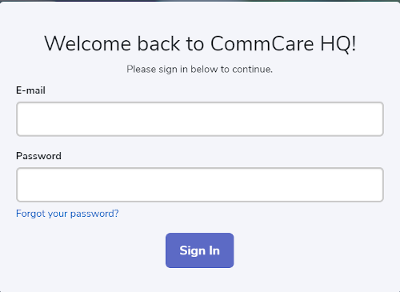

**This step tests:** that Django, Postgres, Couch, and Redis are
functional. Furthermore, it ensures that staticfiles are being served
correctly.

## Step 2a: Creating an application

In this step, we will create a basic Case Management app, populate it
with questions and add case properties.

We'll create an application by selecting either of the Application links
from the Dashboard page; the Dashboard page is the landing page post
login. There is one Application link on the top ribbon and another in
the box on the screen with a phone icon.

You'll be brought to the page below. Give your app a name and click the
'+Add' button. Choose the option 'Case List' to create an application
that uses Case Management. We'll use case management to create cases
later on.

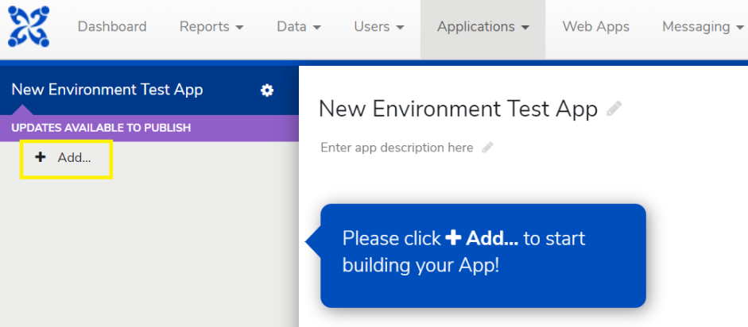

## Step 2b: Populating the Registration Form

The previous step will create two forms under your case list and you'll
be navigated to a page called the 'Formbuilder.' You can populate these
forms with questions by selecting the purple '+Add Question' button.
Let's start by populating the Registration Form with a few questions.
Feel free to use the template I've included in the image below or create
your own questions. If using your own questions, do use one text
question to capture names so we can easily refer to our cases later.

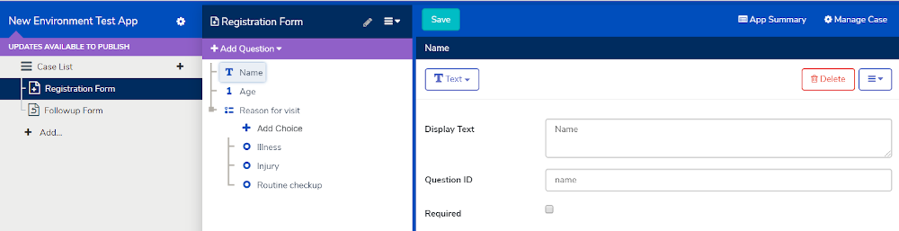

Once questions have been added, save and then click the 'Manage Case'
button at the top right of the screen. This will navigate to the
Registration Form's Case Management tab.

## Step 2c: Saving Case Properties

In this section, add your questions as Case Properties by selecting them
in the dropdowns under the 'Save Questions to Case Properties' section.
Saving a question as a Case Property will allow that information to be
associated with the case. We'll follow up on these case properties later
once we begin using our app.

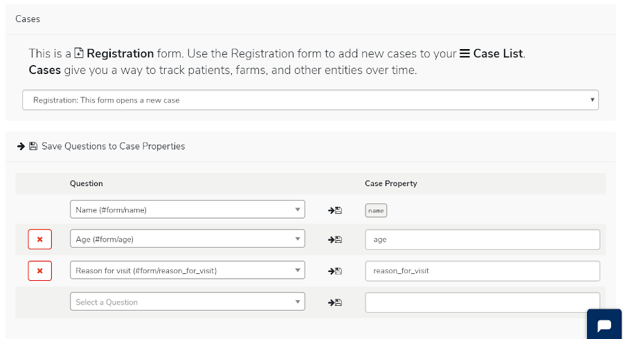

## Step 2d: Populating and creating properties for the Followup Form

Repeat this process with the Followup Form. You can click on the
'Followup Form' text on the left of the screen and this will navigate
you back to the Formbuilder. Again, add a few questions of your own, or
use my template below. Once complete, save and select 'Manage Case.'
Then, add those questions as Case Properties and save again.

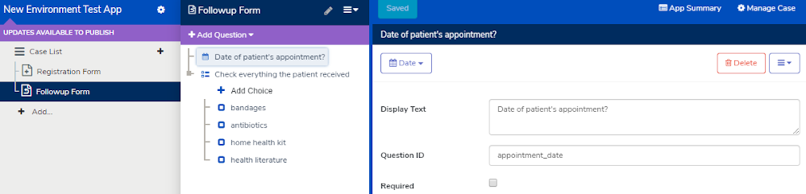

**These steps test:** that Applications can be created. Applications are
the core of how CommCare works and will be used to collect data for your
project. The App Building process also validates that Formplayer is
functional.

To further validate Formplayer, click the teal bar on the right of the
screen, this will open a tool called [Application
Preview](https://confluence.dimagi.com/display/commcarepublic/Application+Preview).
If Formplayer isn't running or isn't connected properly, the Application
Preview pane will be blank.

## Step 3: Creating a mobile worker

We'll create a mobile worker to access our application and submit data.
To do so, select Users from the top ribbon and click Mobile Workers. A
new page should load and you should then see a blue button '+Create
Mobile Worker,' click this and the popup below will appear. Enter
whatever username and password combo you'd like.

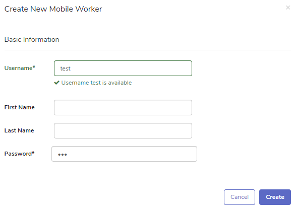

Your mobile worker should now appear as a link under the 'New Mobile
Workers' section.

**This step tests:** Creating a mobile worker and validating a phone
number. The page that lists mobile workers relies on Elasticsearch.

## Step 4a: Deploying your application and submitting forms from mobile

Note: You may skip this step if your project intends to use only Web Apps for
data collection.

Now that we've built an app, we'll validate its deploy. In the top ribbon,
select Applications and click your newly created test application. This will
navigate you to the Releases page. Click the blue 'Make New Version' button and
within a few moments, a version will be available.

Before proceeding, you'll need an Android device with the CommCare mobile app
installed. If you do not have CommCare installed on your device, first go to the
Play Store and download it.

On the 'Releases' page, click the 'Publish' button with your newly created
version. This will launch a modal similar to the one in the image below.
Your version number may differ from mine:

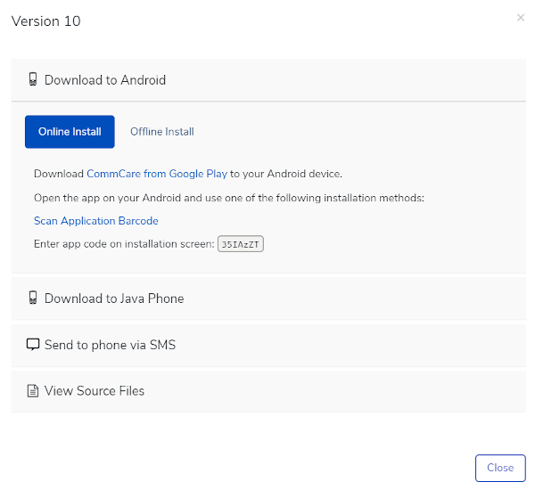

While there are multiple ways to deploy your application to a mobile
device, choose 'Scan Application Barcode' to display a QR code. On your
mobile device, press 'Scan Application Barcode' to install your
application. This should only take a few moments and when complete, you
will be able to log in on your mobile device with the mobile worker
created in the previous step.

Remaining on your mobile device, access and submit your registration
form to create a case and then the followup form to add additional
properties to that case. We'll verify this case was successfully created
in CommCare HQ shortly. After submitting both the Registration and
Followup form, press the blue 'Sync with Server' button on the CommCare
mobile app's home screen. This will ensure the forms on your device are
pushed to CommCare HQ.

**This step tests:** When you attempt to build the app, you may see an error
"Unable to validate form", this likely indicates that Formplayer isn't running
or isn't connected properly to CommCare HQ. The act of logging in on your mobile
device for the first time automatically syncs with the server. Logging in
validates that mobile devices are able to connect with the server.

## Step 4b: Submitting forms through Web Apps

'Web Apps' is a method of submitting data to CommCare HQ online and with a
desktop or laptop. Web Apps must be enabled separately under your application's
Advanced Settings. Return to CommCare HQ and then click the gear icon next to
your application's name. Next, click 'Advanced Settings' to enable Web Apps and
save. Upon completing this step, a purple banner will appear under your
application's name.

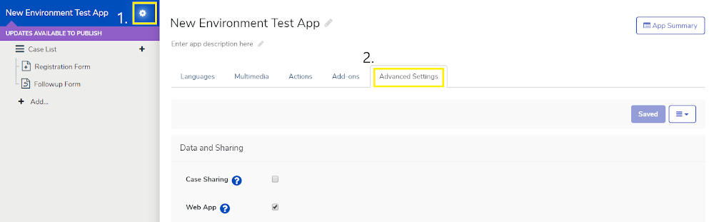

We will need to make a new version of your application on the release page. To
do so, click your application's name and the 'Make New Version' button. On this
newly created version, it's important to toggle the 'Released/In Test' button to
'Released.'

After marking your version as released, click 'Web Apps' in the top ribbon of
CommCare HQ. There, you'll notice a purple button labeled, 'Login As.' Click that
and choose your Mobile Worker. While you can submit forms as a Web User (your
CommCare HQ login), most CommCare users structure their apps around submissions
from Mobile Workers. Using 'Login As' allows you to submit forms as a mobile
worker via Web Apps.

Click on your application and submit the registration and follow-up forms. Once
the forms have been submitted, click the Home icon in Web Apps and then click
the blue Sync button.

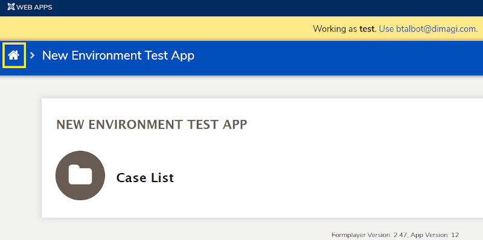

**This step tests:** Using Web Apps tests that Formplayer is working correctly.
We will know whether our submission was a success when we check reports in the
next step.

## Step 5: Viewing submitted data in reports

In this step, we will run a few key CommCare HQ reports to ensure data
was received and accessible.

We've now submitted data from either a mobile device, Web Apps or both.
Let's now view this data in CommCare HQ. If still in Web Apps, click
'Show Full Menu' at the top of the screen to view the ribbon. Otherwise,
simply access CommCare HQ and click 'Reports', then 'Submit History.'

On the Submit History report, simply accept the defaults and click the
blue Apply button. You'll be shown all the forms submitted for your
project along with some key pieces of information about those forms. To
further test reports, access the Case List report (it should be directly
under Submit History on the left of the screen). Again, accept the
default filters and click apply.

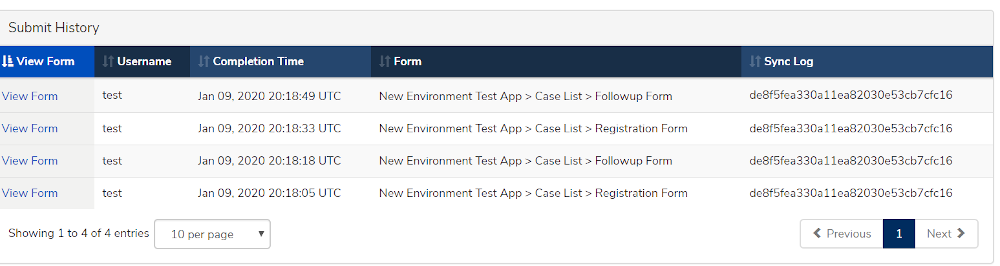

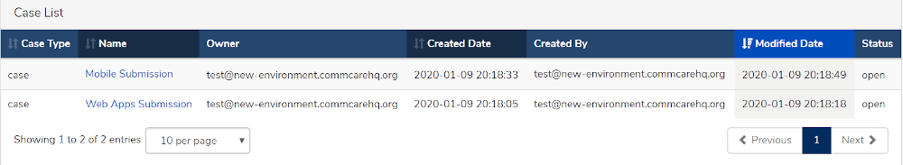

Your results will be unique to your submissions and cases. Feel free to
explore these reports further by clicking either 'View Form' or the name
of the case.

**This step tests:** That forms were processed and then picked up by
Pillowtop and transferred to the appropriate database. The report's list
uses Elasticsearch and its detail use PSQL.

## Step 6a: Exporting CommCare Data: Case Export

CommCare HQ offers multiple ways to retrieve and export your data. This
section will highlight two of these methods; a standard case export and
the creation of an OData feed, which can be used to hook up CommCare HQ
to Tableau and Power BI.

A standard case export can be done by clicking 'Data' from the top
ribbon on CommCare HQ and choosing 'Export Case Data.' Then, click the
'+Add Export' button and define the Application and Case Type in the
modal that appears. Though the application name may differ, your screen
will look like:

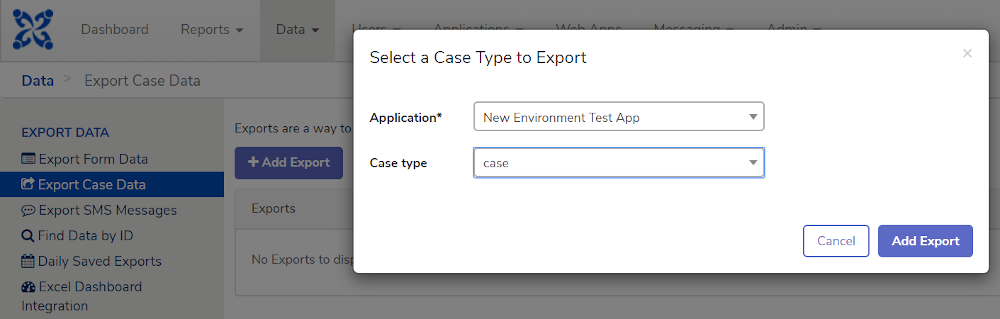

Select 'Add Export,' which will navigate you to the Create Case Data
Export page. For now, accept the defaults and click 'Create' at the
bottom of the screen. This will return you to the 'Export Case Data'
page and next to your newly created export, select the 'Export' button.
You'll now be on the Download Case Data Export page, click 'Prepare
Export' and when ready, click 'Download' to ensure the export works
correctly.

This will initiate an xlsx download of your case data. Feel free to open
it and explore, but simply downloading the data is enough to know the
routine is functional.

**This step tests:** Case Exports, and exports more generally, ensure that
Celery, BlobDB, and Redis are working as expected. Celery processes the export
and saves the result in BlobDB, while process status (the progress bar) is
stored in Redis.

## Step 6b: (Optional) Exporting CommCare Data: OData Feed

CommCare HQ uses multiple API endpoints to allow users to access their data. One
of the APIs built into the CommCare UI is the OData Feed export that can be
integrated with Power BI and Tableau. If applicable to your project, let's use
this to further ensure our access to CommCare data is sound.

To begin, select Data from the top ribbon and click the Power BI/Tableau
Integration. Once the page loads, click the '+Add OData Feed' button.
Similar to the Case Export routine we ran earlier, a modal will pop up
with a series of prompts. As the Feed Type, choose 'Case,' then select
your application and the case type (likely, this will have defaulted to
'case'). Then click 'Add OData Feed' and you'll land on the Create OData
Case Feed page. Accept the defaults and click save.

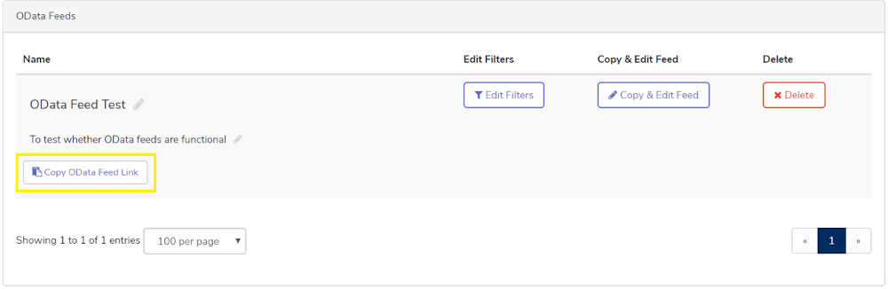

This will return you back to the PowerBi/Tableau Integration page with a
newly created OData Feed. To test, we'll simply view the feed's data in
the URL line of your browser, rather than connect to a BI tool. Click
'Copy OData Feed Link' and then open a new tab in your browser. Paste in
this link and enter your CommCare HQ credentials. In a couple moments,
you'll see your case information in JSON format in your browser

**This step tests:** At least one API endpoint within CommCare. This
routine also uses Elasticsearch.

## Step 7: Mobile worker upload

Lastly, let's validate a data upload in CommCare HQ. Navigate back to
Users in the top ribbon and click Mobile Workers. Next, click 'Download
Mobile Workers' and once the file is ready, 'Download Users.' This will
download an xlsx file with Mobile Worker information. Upon opening the
file; you'll see your mobile worker's info with its password hidden. Add
additional usernames and passwords and save.

Once complete, click 'Return to manage mobile workers' and then the
'Bulk upload' button. Choose your file and once selected, click 'Upload
mobile workers.'

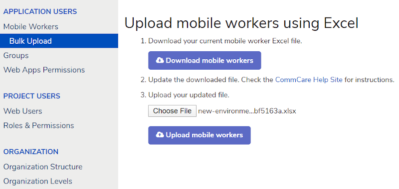

After a moment, you will see 'Mobile Worker upload has finished -
Successfully uploaded X mobile workers.'

**This step tests:** This tests Celery and Redis.

## Step 8: (Optional) SMS Gateway functionality

If your project is going to use SMS capability or wants to explore that
option in the future, we recommend testing this step as well.

To begin, access Messaging from the top ribbon and select View All. Here, you'll
need to set up a new gateway by following the instructions in [this
article](https://confluence.dimagi.com/display/commcarepublic/Setup+an+Android+SMS+Gateway).

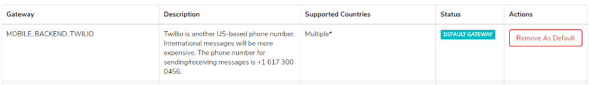

To test, return to Users and Mobile Workers. Then, select your mobile
worker from the list to access the Edit Mobile Worker page. This page
will display all information associated with the mobile worker and allow
us to add a phone number. Scroll down to 'Add a Phone Number' and enter
a phone number you're able to access and are comfortable using to
receive a couple text messages. Please enter the phone number number,
including country code, in digits only. Once done, select 'Add Number.'

Remaining on the Edit Mobile Worker page, click the 'Verify' button.
Within a few moments, you should receive a text message. Replying '123'
will allow your number to be verified and will grant that user full
access to SMS features in CommCare.

**This step tests:** The connection of your SMS Gateway.
