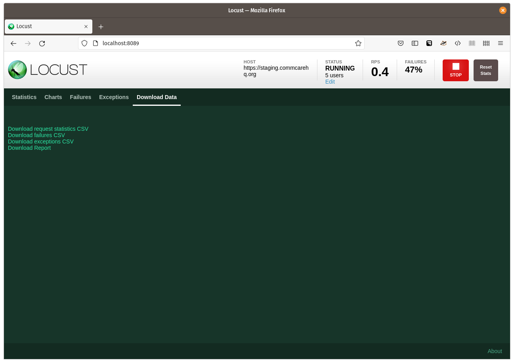

Performance Benchmarking for CommCare HQ using Locust
=====================================================

Introduction
------------

Dimagi uses `Locust <https://locust.io/>`_, and scripts stored in the
`commcare-perf repository <https://github.com/dimagi/commcare-perf/>`_,
for performance benchmarking apps on CommCare HQ.

The commcare-perf repository includes instructions for installing the
scripts.

See Locust's documentation for `running Locust in Docker`_.

Getting started
---------------

1. Start Locust with a web interface::

       (venv) $ locust -f locustfiles/form_submission.py

2. Open http://localhost:8089 in a browser.

3. You will be asked the number of users to simulate, and their spawn
   rate. Start with 1 user, at a spawn rate of 1 user per second, and
   click the "Start swarming" button.

4. Locust will show you a table of statistics. You can switch to the
   "Charts" tab to see requests per second, response times, and the
   number of simulated users.

   .. image:: locust_statistics.png
      :alt: Locust statistics

5. Click "Stop" and increase the number of users to see how CommCare is
   affected.

Submitting your own forms
-------------------------

``locustfiles/form_submission.py`` uses three example form submissions
for testing. They are saved in the ``xforms/`` directory.

If you would like to use your own form submissions, you can find them in
CommCare.

1. Navigate to "Reports" > "Case List", and find a sample case with test
   data. (Do not use a real case.)

2. Select the case, and choose the "Case History" tab.

3. Select a form. (If you select the form that registered the case, you
   will get duplicate cases.)

4. Choose "Raw XML".

5. Copy and paste the XML into a file and save it in the ``xforms/``
   directory.

6. Repeat steps 1 to 5 for as many forms as you wish to submit.

7. ``locustfiles/form_submission.py`` will submit all the files it finds
   in the ``xforms/`` directory. If you don't want to use the original
   examples, just delete them.

8. Restart Locust to test using your form submissions.

Saving results
--------------

In Locust, switch to the "Download Data" tab.

Here you can download the report, and various data in CSV format.

.. _running Locust in Docker: https://docs.locust.io/en/stable/running-locust-docker.html>
